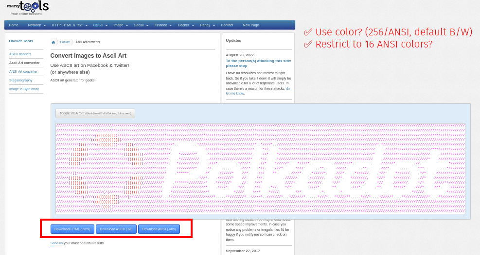

<h1 align="center">ASCII ART</h1>

Using this awesome [🤓 ASCII art generator](https://manytools.org/hacker-tools/convert-images-to-ascii-art/go/), upload [.polkadot-logo.png](./polkadot-logo.png):

The downloads are included in this repo:

- [ANS format](Polakdot-ascii-art.ans)
- [HTML format](./Polakdot-ascii-art.html)
- [TXT format](./Polakdot-ascii-art.txt)

There are some fun user generated [`sh` ready ones](./polkadot-ascii-art.sh) to use in TUIs too!

## License

[Unlicense](./LICENSE)
